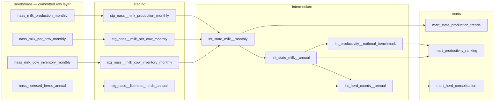
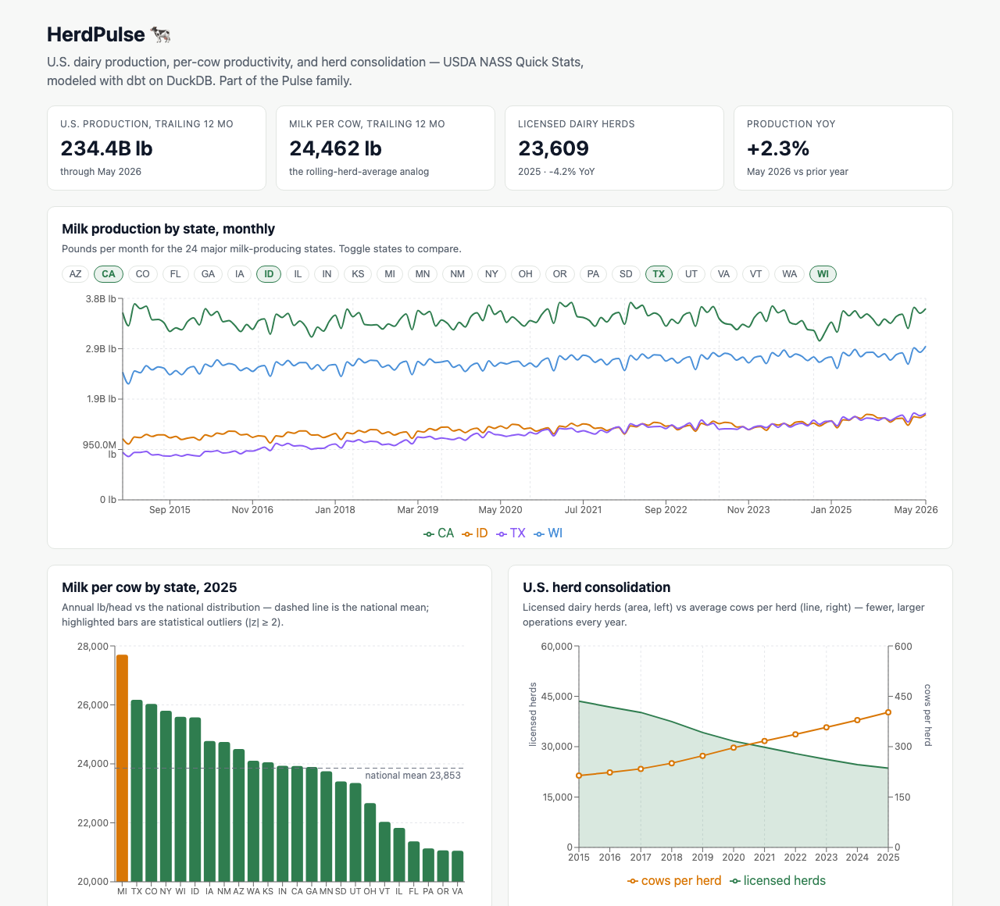

# HerdPulse 🐄📈

**A production-shaped analytics pipeline over public U.S. dairy data — staging → intermediate → marts, tested and documented, with a live trend dashboard.**

HerdPulse turns USDA milk-production data into a small warehouse and dashboard that track how U.S. dairy is performing and consolidating: production and per-cow yield by state over time, productivity rankings against the national distribution, and the long structural decline in licensed dairy herds. It's built to the same conventions as my [Medicare Provider Outliers](https://github.com/kristenmartino/medicare-provider-outliers) project, and it's the newest member of my *Pulse* family of monitored-system pipelines alongside GridPulse (energy demand) and SpecialtyPulse (specialty reimbursement).

> **Why this project exists.** I build analytics for regulated, data-dense domains — insurance actuarial, federally regulated transportation, energy, and CMS Medicare data. HerdPulse is the same discipline pointed at animal agriculture: public aggregates modeled cleanly enough that the herd-level ecosystem they sit downstream of is legible. The data engineering is the constant; the domain is the variable.

---

## The dairy data ecosystem this sits in

Farm-level dairy production data in the U.S. flows through the **Dairy Herd Improvement (DHI)** system — the milk-recording program run through regional **DHIA** associations and processing centers, with genetic evaluations produced by the **Council on Dairy Cattle Breeding (CDCB)**. At the barn, herds run **herd-management software** — platforms like **DC305 (DairyComp 305), BoviSync, PCDART, and DHIPlus** — that capture per-cow events and performance. The core records include:

- **Test-day yield** — milk weight (plus fat, protein, and somatic cell count from the sample) recorded on a cow's periodic test day; the atomic record milk-recording is built on.
- **305-day mature-equivalent (ME) lactation** — a cow's lactation standardized to 305 days and a mature-age basis so cows of different ages and calving dates can be compared; the backbone of U.S. genetic evaluation.
- **Somatic cell count / score (SCC / SCS)** — the milk-quality and udder-health signal; lower is better, and it rolls up to herd and state averages.
- **Rolling herd average (RHA)** — the herd's trailing production benchmark, the number a dairy manager watches month to month.
- **Days in milk (DIM)**, calving/dry-off dates, and lactation number — the lifecycle context around each record.

HerdPulse works **one level up** from that barn data: it models the **public state- and national-level aggregates** USDA publishes (which are themselves built from this ecosystem), because that data is open and reproducible. But the marts are designed to *mirror* the questions a herd-analytics platform asks — productivity benchmarking, trend detection, and structural change — so the same model shapes would extend naturally to test-day and lactation grain.

*(Sources for the domain terms above: USDA NASS milk-recording documentation; CDCB / DHIA DHI record definitions; peer-reviewed reviews of test-day and 305-day ME lactation methodology. Cited so nothing here is hand-waved.)*

---

## What HerdPulse builds

**Source:** [USDA NASS Quick Stats](https://quickstats.nass.usda.gov/) — public milk production, milk-per-cow, milk-cow inventory (monthly, by state, for the 24 major milk-producing states + U.S. total), and licensed dairy-herd counts (annual, by state). See [`NASS_DOWNLOAD.md`](./NASS_DOWNLOAD.md) for the acquisition guide and [`data/README.md`](./data/README.md) for the exact as-run queries (two `short_desc` strings drifted from the guide's first guess and were re-discovered live via `get_param_values`).

**Stack:** dbt + DuckDB, `stg_ / int_ / mart_` layering, 58 data-quality tests, `dbt docs` lineage. Dashboard in React + Recharts (Vite).

### The marts

| Mart | Question it answers | Grain |
|---|---|---|
| `mart_state_production_trends` | How is milk production and per-cow yield trending by state? (YoY, rolling) | state × month |
| `mart_productivity_ranking` | Which states lead on milk-per-cow, and by how much vs. the national distribution? (percentile / z-score) | state × year |
| `mart_herd_consolidation` | How fast are licensed dairy herds disappearing while cows-per-herd rises? | state × year |

The productivity ranking reuses the **peer-benchmarking + z-score methodology** from Medicare Provider Outliers: instead of ranking providers against same-specialty peers, it ranks states against the national milk-per-cow distribution. Same statistical spine, new domain.

### Lineage



### Data-quality tests

Modeled on my standing rule that **reconciliation is a test, not a hope**:
- Grain integrity — `not_null` + `unique` on every (state × period) key
- `accepted_values` on state
- `relationships` from marts back to staging
- Business-rule singular tests — per-cow yield within a sane physical range; **national total reconciles to the sum of states within tolerance**

**58 tests across 11 models, all passing** — 52 schema tests (grain keys, accepted values/ranges, relationships), 3 singular business rules (`assert_per_cow_yield_within_range`, `assert_national_total_reconciles`, `assert_cows_per_herd_within_reason`), and 3 dbt unit tests proving the ranking mart's z-score arithmetic, ordering, and threshold/exclusion gates on mocked inputs:

```
$ dbt build
Finished running 4 seeds, 7 table models, 55 data tests, 3 unit tests, 4 view models
Done. PASS=73 WARN=0 ERROR=0 SKIP=0 NO-OP=0 TOTAL=73
```

The reconciliation test is honest about coverage: the 24 monthly-published states are ~95–96% of U.S. production, so it asserts the state sum lands inside [90%, 100%] of the U.S. total for **every month** — never that 24 states equal the nation.

---

## Dashboard



Four views over the marts: production trend by state, per-cow productivity ranking (with national-distribution context — 2025's outlier bar is Michigan at 27,665 lb), herd consolidation over time (licensed herds nearly halved 2015→2025 while cows-per-herd rose 214→402), and a national KPI strip (total production, avg per-cow, licensed-herd count, latest YoY).

---

## Run it

```bash
git clone https://github.com/kristenmartino/herdpulse && cd herdpulse
make install         # uv sync + dbt deps (needs uv: https://docs.astral.sh/uv/)
make build           # dbt seed + run + test — fully offline from the committed seeds
make docs            # dbt docs (static single file) into target/
make dashboard-dev   # Vite dev server on http://localhost:5173

# optional — re-pull the source data (free key: https://quickstats.nass.usda.gov/api)
cp .env.example .env       # add NASS_API_KEY=...
make fetch && make build && make export
```

CI runs the same full offline `dbt build` (seeds + models + all 58 tests) on every push — possible because the raw layer ships with the repo, and deliberately stronger than the parse-only CI my Medicare project's unshippable source data allowed.

Secrets note: the NASS API key lives in `.env` (gitignored) — it is never committed.

---

## Repo structure

```
herdpulse/
├── README.md · CONVENTIONS.md · NASS_DOWNLOAD.md
├── Makefile · dbt_project.yml · packages.yml · profiles.yml.example
├── pyproject.toml · uv.lock          # uv-managed env: dbt-duckdb, duckdb, requests
├── data/README.md                    # exact as-run Quick Stats queries (warehouse file gitignored)
├── scripts/
│   ├── fetch_nass.py                 # 4 API pulls → seeds, with live short_desc discovery
│   └── export_marts.py               # marts → dashboard/public/data/*.json
├── seeds/nass/                       # committed raw layer — 4 CSVs, column_types pinned
├── macros/                           # zscore / modified_zscore / is_outlier (ported) + NASS parsing
├── models/
│   ├── staging/                      # 4 stg_nass__* views + _staging.yml
│   ├── intermediate/                 # 4 int_* tables + _intermediate.yml
│   └── marts/                        # 3 mart_* tables + _marts.yml (incl. 3 unit tests)
├── tests/                            # 3 singular assert_* business rules
├── analyses/                         # ad-hoc exploration
├── docs/                             # static dbt docs site (GitHub Pages) + dashboard screenshot
├── dashboard/                        # Vite + React + Recharts over committed mart JSON
└── .github/workflows/dbt-ci.yml      # full offline dbt build + test on every push
```

---

## Notes & honesty

- All figures trace to the actual NASS pull and the actual build — no synthetic or fabricated numbers.
- HerdPulse models **public aggregate** data, not proprietary herd-management or DHI test-day records; the domain section above describes the ecosystem this data derives from, not data used in this build.
- Built as a focused portfolio piece; scope is deliberately tight.

---

*Part of the Pulse family: [GridPulse](https://gridpulse.kristenmartino.ai) · SpecialtyPulse · HerdPulse · [portfolio](https://kristenmartino.ai)*
